<div align="center">

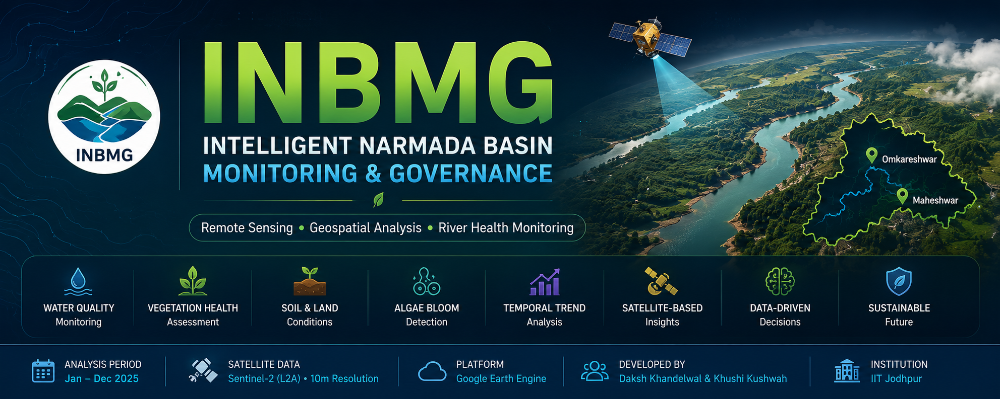

# INBMG — Intelligent Narmada Basin Monitoring & Governance

### An AI-Driven Framework for Ecological Conservation and Public Safety on the Narmada River

</div>

---

**Authors:** Khushi Kushwah · Daksh Khandelwal  
**Affiliation:** B.S. in Applied AI & Data Science, School of AI and Data Science, Indian Institute of Technology (IIT) Jodhpur  
**Academic Guidance:** Dr. Priyank J. Sharma, Assistant Professor, Department of Civil Engineering, IIT Indore  
**Project Status:** Student research project. The currently *implemented* technical component is a 2025 remote-sensing river-health analysis; the broader INBMG vision remains at the concept/proposal stage (see [Project Evolution](#project-evolution)).  
**Core Methods (implemented component):** Sentinel-2 multispectral remote sensing · Google Earth Engine · Spectral index analysis (NDTI, NDWI, MNDWI, AWEI, FAI, NDVI, BSI, TSM)

> ⚠️ **Read this first:** INBMG began as a large, multi-domain AI concept (crowd safety, river navigation, biodiversity, eDNA, digital governance, etc.). **Only the 2025 remote-sensing river-health analysis has been implemented and documented with real results.** Everything else described in the original concept, abstract, and presentations is proposed/future work. This README is written to make that distinction explicit throughout.

---

## Table of Contents

1. [Project Overview](#project-overview)
2. [Project Evolution](#project-evolution)
3. [Project Concept](#project-concept)
4. [Project Abstract](#project-abstract)
5. [Project Development](#project-development)
6. [Updated Presentation — Visual Walkthrough](#updated-presentation--visual-walkthrough)
7. [Current Technical Implementation](#current-technical-implementation)
8. [Study Area](#study-area)
9. [Methodology](#methodology)
10. [Remote-Sensing Indices](#remote-sensing-indices)
11. [Data](#data)
12. [Results](#results)
13. [Technical Report](#technical-report)
14. [Methodology Documentation](#methodology-documentation)
15. [Future Roadmap](#future-roadmap)
16. [Repository Structure](#repository-structure)
17. [Limitations](#limitations)
18. [Academic Context](#academic-context)
19. [Citation](#citation)
20. [License](#license)
21. [Disclaimer](#disclaimer)

---

## Project Overview

**INBMG (Intelligent Narmada Basin Monitoring & Governance)** is a student-led research project exploring how AI, remote sensing, and geospatial analysis could support monitoring and governance of the Narmada River Basin — a river of major ecological, agricultural, and cultural significance in India.

**Why it was proposed:** Traditional river-basin management relies on manual, fragmented, and slow data collection (periodic water sampling, manual crowd monitoring, limited-coverage CCTV), which cannot support timely, informed decisions — particularly around mass religious gatherings that stress both people and the river ecosystem.

**How the concept evolved:** The project began as a very broad brainstorm covering crowd safety, river navigation, biodiversity, water quality, and digital governance. Through abstract preparation, professor outreach, and academic guidance, the scope was progressively refined and grounded into something the team could actually execute and document.

**What is currently implemented:** A remote-sensing-based environmental analysis of the Narmada River for the year 2025, using Sentinel-2 satellite imagery processed in Google Earth Engine to compute eight spectral indices across the Omkareshwar and Maheshwar stretches.

**What is future scope:** Crowd monitoring via computer vision, intelligent river navigation, eDNA-based biodiversity monitoring, and an integrated digital governance dashboard remain proposed components of the broader INBMG vision — see [Future Roadmap](#future-roadmap).

---

## Project Evolution

The project moved through several distinct stages. Each is documented in this repository with its original artifacts.

| Stage | What Happened | Where It Lives |
|---|---|---|
| 1. Initial Concept & Brainstorm | Broad brainstorming of everything a "Narmada Project" AI system could cover: CCTV, crowd measurement, digital website, AI navigation, river health, remote sensing, biodiversity assessment. | [`01-Project-Concept/`](./01-Project-Concept/) |
| 2. Workflow Creation | The broad concept was mapped visually using Excalidraw, capturing every proposed sub-system and its components. | [`01-Project-Concept/INBMG-Initial-Workflow.png`](./01-Project-Concept/INBMG-Initial-Workflow.png) |
| 3. Abstract Preparation | A formal project abstract was written to communicate the idea to professors and potential academic mentors. | [`02-Project-Abstract/`](./02-Project-Abstract/) |
| 4. Professor Outreach | The abstract was shared with multiple professors to seek mentorship and feasibility feedback. | — |
| 5. Academic Guidance | Dr. Priyank J. Sharma (Dept. of Civil Engineering, IIT Indore) engaged with the project and provided guidance during its development. | See [Academic Context](#academic-context) |
| 6. Initial Presentation | An early, broad presentation introducing the AI-based Narmada river and basin monitoring concept. | [`03-Project-Development/`](./03-Project-Development/) |
| 7. Updated Presentation | A refined presentation focused more specifically on an AI-Based Crowd & River Health Monitoring System. | [`03-Project-Development/`](./03-Project-Development/), [Visual Walkthrough](#updated-presentation--visual-walkthrough) |
| 8. Remote Sensing Implementation | The team pivoted to executing a concrete, deliverable piece of the vision: remote-sensing river-health analysis. | [`04-Remote-Sensing-Analysis/`](./04-Remote-Sensing-Analysis/) |
| 9. 2025 Technical Analysis | Eight spectral indices computed and analyzed for Omkareshwar and Maheshwar using Sentinel-2 + Google Earth Engine, written up as a full technical report. | [`07-Technical-Report/`](./07-Technical-Report/) |
| 10. Current Repository | This repository — organizing and documenting the full history, current implementation, and future scope. | You are here. |

---

## Project Concept

The project began with an initial brainstorming and conceptualization phase, visualized using **Excalidraw**. The workflow diagram below captures the full breadth of the original "Narmada Project" concept — CCTV monitoring, AI threat detection, real-time crowd measurement, a digital platform, intelligent river navigation, river-health sensors, remote sensing (GIS), and biodiversity assessment (including an eDNA-based species-identification pipeline).

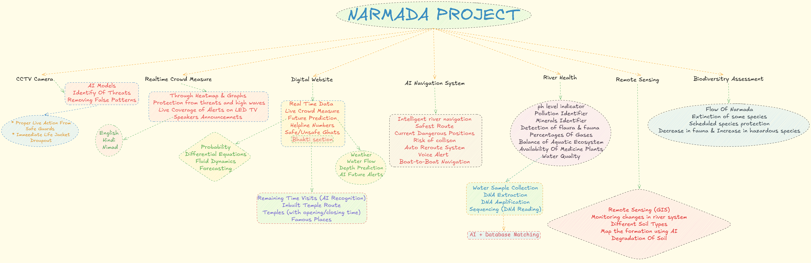

This diagram represents the **broadest possible scope** of the project at its earliest stage — it is a brainstorm, not an implementation plan. Many of the branches shown here (AI navigation, real-time crowd measurement, biodiversity assessment) remain future scope, as detailed in the [Future Roadmap](#future-roadmap).


---

## Project Abstract

After the initial workflow, the team prepared a formal **project abstract**, *"Intelligent Narmada Basin Monitoring & Governance (INBMG): An AI-Driven Framework for Ecological Conservation and Public Safety."* It was prepared for and shared with academic mentors, including Dr. Priyank J. Sharma of IIT Indore, and frames the project for the National River Conservation Directorate (NRCD) and the National Green Tribunal (NGT) as its intended stakeholders.

The abstract lays out:
- The core problem (crowd safety at pilgrimage gatherings, shifting river topography, and slow/manual ecological tracking)
- A three-part proposed architecture: intelligent urban safety infrastructure, environmental/eDNA monitoring, and digital governance
- A three-phase implementation roadmap (Safety Excellence → Ecological Resilience → Governance Integration)

📄 Read the full abstract: [`02-Project-Abstract/INBMG-Project-Abstract.pdf`](./02-Project-Abstract/INBMG-Project-Abstract.pdf)

---

## Project Development

Two presentations were developed as the project matured:

### Initial Presentation
An earlier, broader conceptual presentation introducing the AI-based Narmada river and basin monitoring idea.
📄 [`03-Project-Development/01-Initial-Project-Presentation.pdf`](./03-Project-Development/01-Initial-Project-Presentation.pdf)

### Updated Presentation
A refined presentation, produced after guidance and feedback, that focuses the project more specifically around an **AI-Based Crowd & River Health Monitoring System**.
📄 [`03-Project-Development/02-Updated-Project-Presentation.pdf`](./03-Project-Development/02-Updated-Project-Presentation.pdf)

Both presentations remain the **official presentation artifacts**. The slide images embedded below are an additional visual preview, not a replacement.

---

## Updated Presentation — Visual Walkthrough

All 13 slides of the updated presentation are embedded below in order, so a visitor can understand the refined project concept without downloading the PDF/PPT.

> **Important framing:** These slides describe the project's *proposed design* — AI-based crowd monitoring, water-quality estimation, dashboards, case studies with example impact figures, and a technology roadmap. **None of the crowd-monitoring, dashboard, or eDNA systems shown in these slides are implemented in this repository.** The case-study figures and dashboard screenshots shown are illustrative mockups of the intended system, not results from deployed software. The only implemented component is the remote-sensing river-health analysis described in [Current Technical Implementation](#current-technical-implementation).

### Slide 01 — AI-Based Crowd & River Health Monitoring System
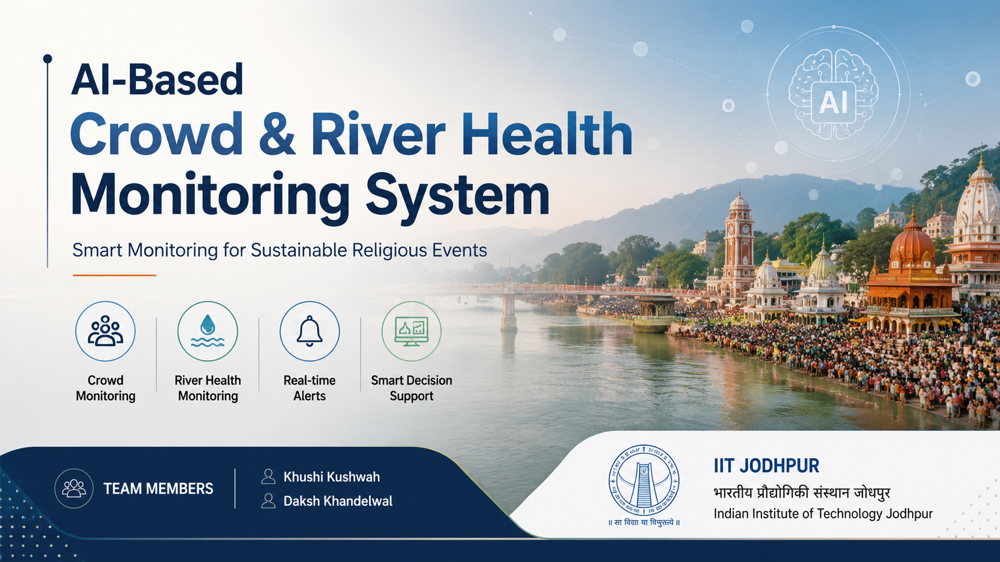
The title slide, framing the refined project as "Smart Monitoring for Sustainable Religious Events" built around four proposed pillars: crowd monitoring, river-health monitoring, real-time alerts, and smart decision support.

### Slide 02 — Problem Statement
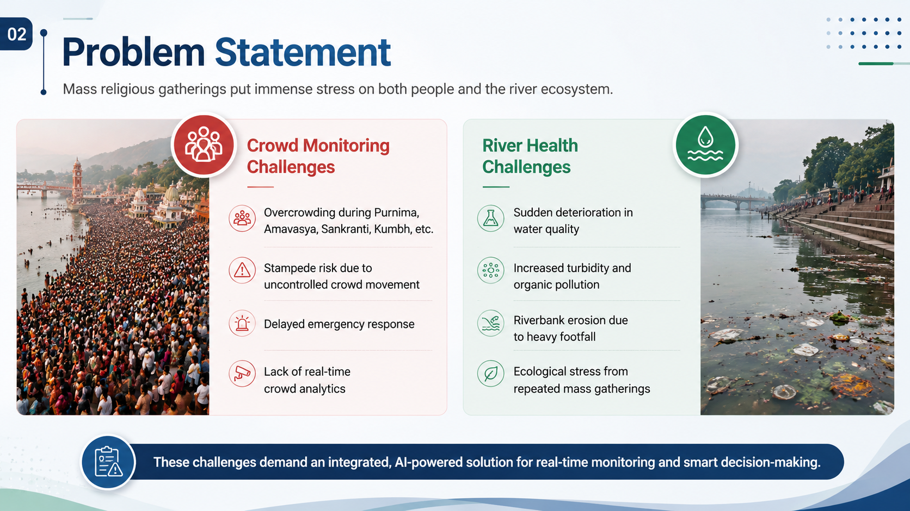
Frames the dual challenge: mass religious gatherings create crowd-safety risks (overcrowding, stampede risk, delayed emergency response) alongside river-health risks (sudden water-quality deterioration, turbidity, riverbank erosion, ecological stress). This slide establishes the *why* behind the project.

### Slide 03 — Why Current Systems Are Not Enough
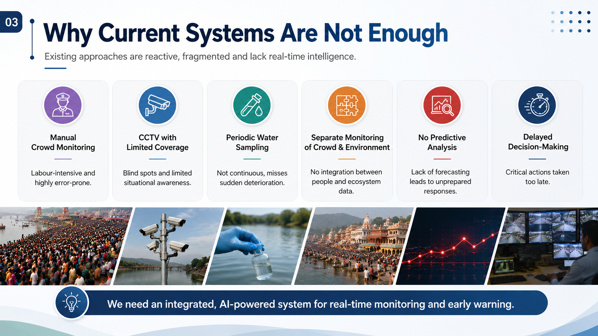
Argues that existing approaches — manual crowd monitoring, limited-coverage CCTV, periodic water sampling, siloed monitoring of people vs. environment, no predictive analysis, and delayed decision-making — are reactive and fragmented, motivating the case for an integrated AI-powered alternative.

### Slide 04 — Proposed AI-Based Solution
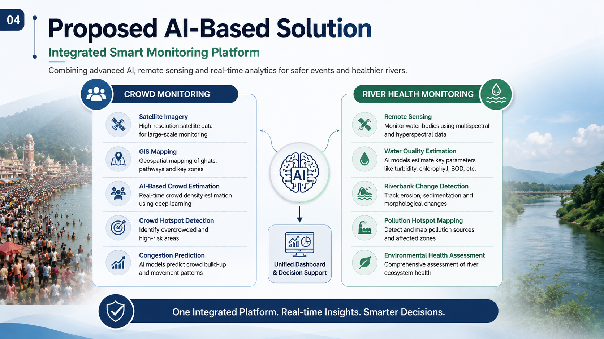
Introduces the proposed "Integrated Smart Monitoring Platform" concept, pairing a crowd-monitoring track (satellite imagery, GIS mapping, AI crowd estimation, hotspot detection, congestion prediction) with a river-health track (remote sensing, water-quality estimation, riverbank change detection, pollution-hotspot mapping), feeding a unified dashboard.

### Slide 05 — AI Solution Architecture
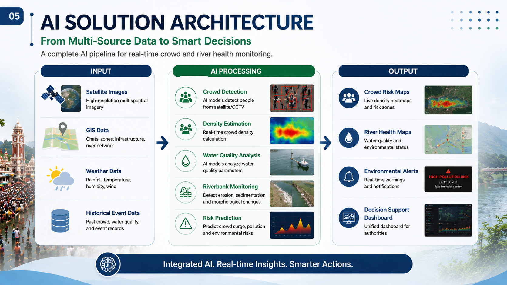
Lays out a proposed input → AI processing → output pipeline: satellite images, GIS data, weather data, and historical event data feeding AI modules (crowd detection, density estimation, water-quality analysis, riverbank monitoring, risk prediction) that would produce crowd-risk maps, river-health maps, environmental alerts, and a decision-support dashboard.

### Slide 06 — River Health Monitoring Solution
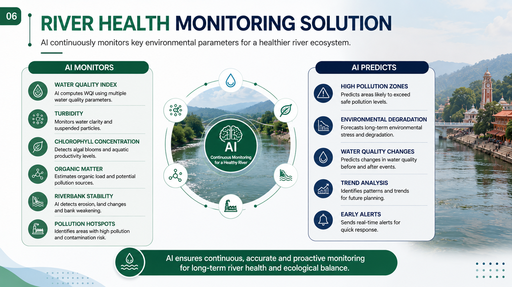
Describes the proposed river-health monitoring design: AI tracking water-quality index, turbidity, chlorophyll concentration, organic matter, riverbank stability, and pollution hotspots, with predictive outputs for high-pollution zones and environmental degradation.

### Slide 07 — Crowd Monitoring Solution
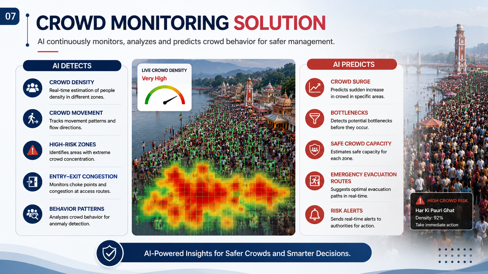
Describes the proposed crowd-monitoring design: AI-based detection of crowd density, movement, high-risk zones, and entry/exit congestion, with predictive outputs for crowd surges, bottlenecks, and emergency evacuation routing. The heatmap and "Live Crowd Density" panel shown are illustrative mockups of the intended interface, not a live system output.

### Slide 08 — Smart Decision Support Dashboard
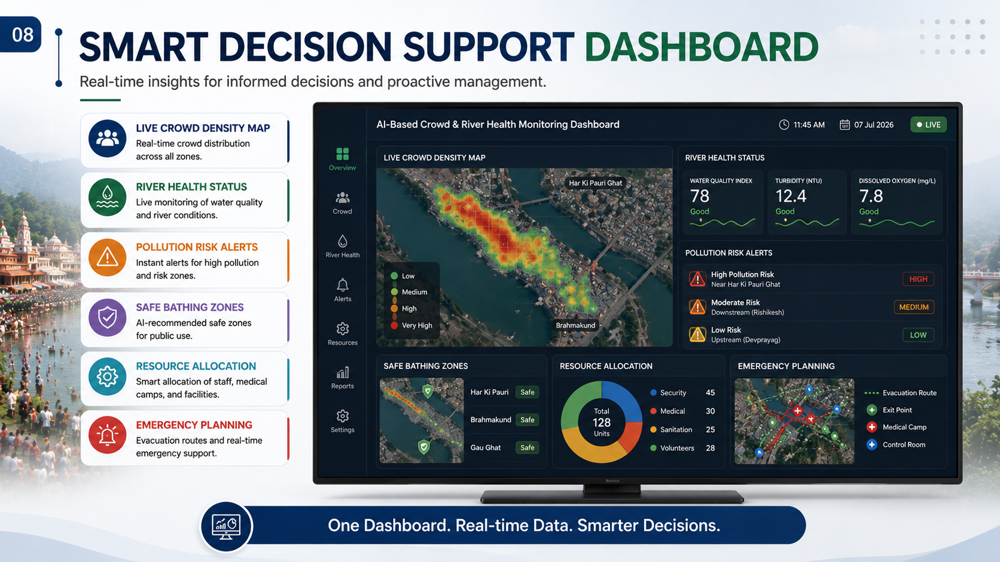
A mockup of the envisioned unified dashboard, showing how a live crowd-density map, river-health status, pollution-risk alerts, safe-bathing-zone recommendations, resource allocation, and emergency planning could be combined into a single administrative view. This is a design mockup, not a built dashboard.

### Slide 09 — Expected Outcomes
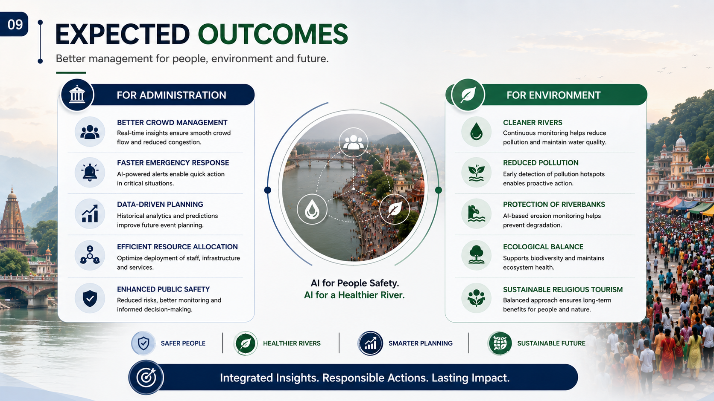
Lists the intended benefits of the proposed system for administration (better crowd management, faster emergency response, data-driven planning) and for the environment (cleaner rivers, reduced pollution, riverbank protection, ecological balance). These are anticipated outcomes of the *proposed* full system, not measured results.

### Slide 10 — Technologies & Tools
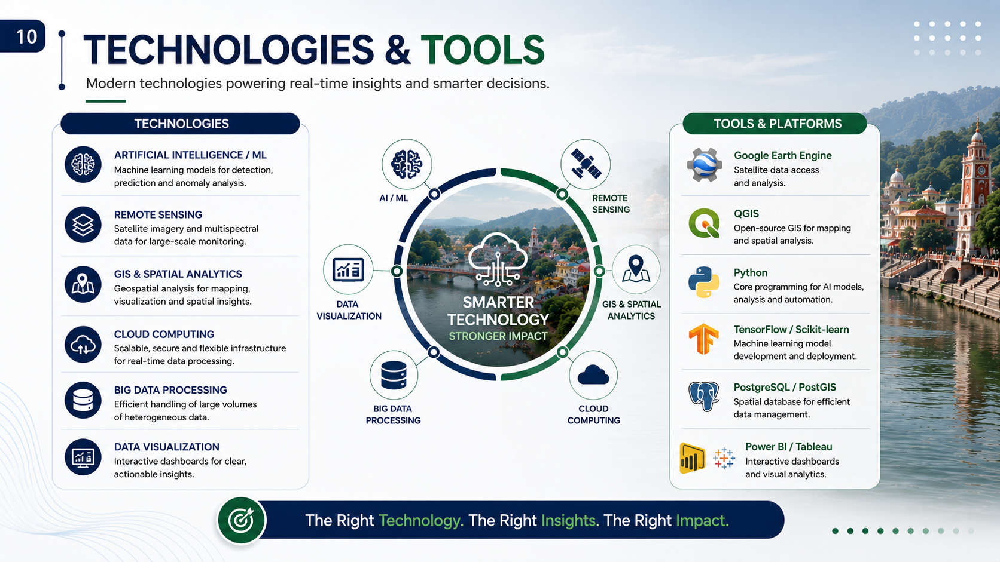
Lists the technology stack envisioned for the full platform: AI/ML, remote sensing, GIS & spatial analytics, cloud computing, big data processing, and data visualization, alongside candidate tools (Google Earth Engine, QGIS, Python, TensorFlow/Scikit-learn, PostgreSQL/PostGIS, Power BI/Tableau). Of these, **Google Earth Engine and Python-based geospatial analysis are the tools actually used** in the implemented remote-sensing work; the rest represent the broader intended stack.

### Slide 11 — Case Studies & Impact
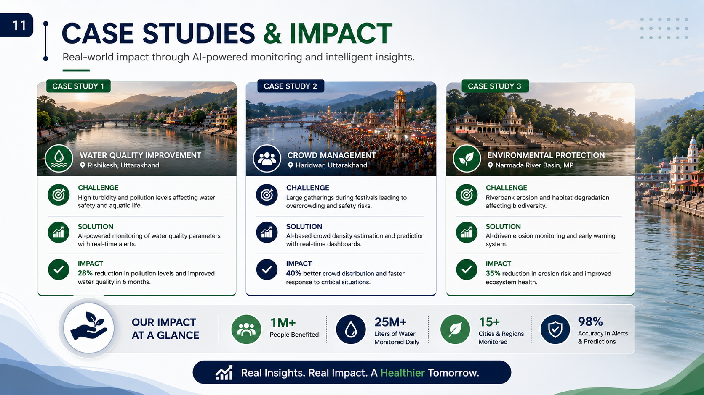
Presents three illustrative case-study scenarios (water-quality improvement, crowd management, environmental protection) with example impact figures. **These are illustrative/target scenarios for the proposed system, not measured outcomes of a deployed INBMG system.** They should not be read as validated results of this project.

### Slide 12 — Future Scope & Roadmap
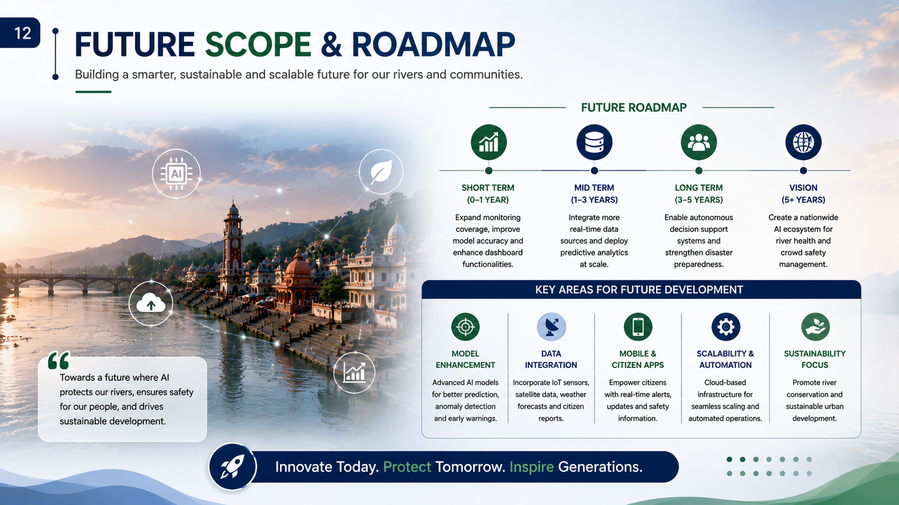
Lays out a short-term / mid-term / long-term / vision roadmap (expanding monitoring coverage → integrating more real-time data sources → autonomous decision support → a nationwide AI ecosystem for river health and crowd safety), plus key development areas: model enhancement, data integration, mobile/citizen apps, scalability, and sustainability focus. This directly maps to the [Future Roadmap](#future-roadmap) section of this README.

### Slide 13 — Thank You / Questions & Discussion
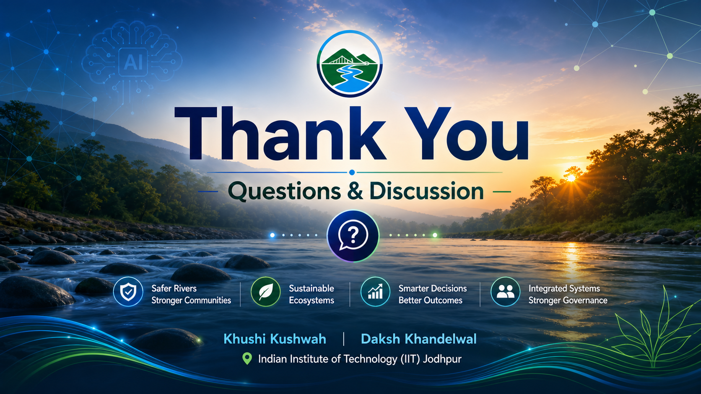
Closing slide, restating the project's four intended pillars — safer rivers & stronger communities, sustainable ecosystems, smarter decisions, and integrated systems & stronger governance.

---

## Current Technical Implementation

The technical work actually implemented and documented in this repository is a **2025 remote-sensing-based river/environmental analysis** of the Narmada River, using **multiple spectral indices** and **monthly statistical analysis**. This is a narrower, concretely executed subset of the broader INBMG vision shown in the presentations above.

- **Geographic scope:** Omkareshwar and Maheshwar stretches of the Narmada River
- **Imagery source:** Sentinel-2 Level-2A (Surface Reflectance) multispectral satellite data
- **Processing platform:** Google Earth Engine (GEE)
- **Temporal scope:** Calendar year 2025 (month-by-month, with documented monsoon-period exclusions — see [`08-Methodology/data-availability.md`](./08-Methodology/data-availability.md))
- **Indices computed:** NDTI, NDWI, MNDWI, AWEI, FAI, NDVI, BSI, TSM (see [Remote-Sensing Indices](#remote-sensing-indices))

---

## Study Area

The analysis focuses on two ecologically sensitive stretches of the Narmada River: **Omkareshwar** and **Maheshwar**. These reaches were selected as the geographic scope for all eight spectral indices computed in this study. Full study-area context is documented in the technical report, Chapter 3.

---

## Methodology

The full implemented workflow — data acquisition, cloud masking, water masking, index computation, monthly statistical analysis, and trend generation — is documented in [`08-Methodology/methodology.md`](./08-Methodology/methodology.md).

**Workflow summary:**

```
Sentinel-2 (Level-2A) via Google Earth Engine
        → Spatial filtering (Omkareshwar & Maheshwar)
        → Cloud masking (QA60 band)
        → Water mask generation
        → Spectral index computation (8 indices)
        → Monthly statistical extraction & time-series generation
        → Export of thematic maps, CSV summaries, and trend graphs
```

---

## Remote-Sensing Indices

| Index | Full Name | Purpose | Role in Project |
|---|---|---|---|
| [NDTI](./08-Methodology/index-formulas.md#1-ndti--normalized-difference-turbidity-index) | Normalized Difference Turbidity Index | Suspended sediment / turbidity estimation | Tracks seasonal turbidity shifts |
| [NDWI](./08-Methodology/index-formulas.md#2-ndwi--normalized-difference-water-index) | Normalized Difference Water Index | Open water body delineation | Baseline water-surface mapping |
| [MNDWI](./08-Methodology/index-formulas.md#3-mndwi--modified-normalized-difference-water-index) | Modified NDWI | Water extraction with reduced built-up noise | Basis for the water mask used elsewhere |
| [AWEI](./08-Methodology/index-formulas.md#4-awei--automated-water-extraction-index) | Automated Water Extraction Index | Shadow-resilient water extraction | Dry-season river contraction mapping (Jan–Jun) |
| [FAI](./08-Methodology/index-formulas.md#5-fai--floating-algae-index) | Floating Algae Index | Algal bloom / eutrophication detection | Post-monsoon algal bloom monitoring |
| [NDVI](./08-Methodology/index-formulas.md#6-ndvi--normalized-difference-vegetation-index) | Normalized Difference Vegetation Index | Riparian vegetation health | Riparian-health assessment (with BSI) |
| [BSI](./08-Methodology/index-formulas.md#7-bsi--bare-soil-index) | Bare Soil Index | Exposed riverbank / erosion detection | Riparian-health assessment (with NDVI) |
| [TSM](./08-Methodology/index-formulas.md#8-tsm--total-suspended-matter) | Total Suspended Matter | Suspended-particle concentration | Quantitative sediment-loading indicator |

Full formulas, bands, and interpretation: [`08-Methodology/index-formulas.md`](./08-Methodology/index-formulas.md)

---

## Data

The [`05-Data/`](./05-Data/) folder is organized into eight index subfolders (NDTI, NDWI, MNDWI, AWEI, FAI, NDVI, BSI, TSM), each intended to hold month-wise CSV exports named using the convention:

```
01-NDTI-January-2025.csv
02-NDTI-February-2025.csv
...
```

Not every index has data for every month — see [`08-Methodology/data-availability.md`](./08-Methodology/data-availability.md) for the exact monthly breakdown per index and the documented reasons (primarily monsoon-season cloud cover) for the missing months.

> **Status:** The CSV files themselves were not included among the source files supplied for this repository build, so the `05-Data/` folders currently exist as a structural placeholder. Add the actual GEE-exported CSVs to complete this section — see the note in [`data-availability.md`](./08-Methodology/data-availability.md).

---

## Results

The [`06-Results/`](./06-Results/) folder holds the **yearly trend image** for each of the eight indices (one image per index). Monthly histogram images are kept exclusively under [`04-Remote-Sensing-Analysis/`](./04-Remote-Sensing-Analysis/) to avoid duplicating the same images in two places.

General seasonal patterns documented in the technical report (see the report for full per-index discussion) include: relatively clear, low-turbidity conditions in January–February; a pre-monsoon rise in turbidity and suspended matter through March–May; a monsoon data gap due to cloud cover; and post-monsoon effects such as elevated turbidity from runoff and, for FAI, a marked October algal-bloom spike. These are the technical report's own interpretations and should not be treated as generalized conclusions beyond the 2025 Omkareshwar–Maheshwar study.

> **Status:** Monthly histogram and trend images were not included among the source files supplied for this repository build. `04-Remote-Sensing-Analysis/` and `06-Results/` currently exist as structural placeholders — add the actual GEE-exported images to complete this section.

---

## Technical Report

The complete technical report, *"Narmada Basin Monitoring: A Remote Sensing and Geospatial Analysis Approach for River Health Assessment,"* is the primary source of truth for this project's implemented work.

📄 [`07-Technical-Report/INBMG-Narmada-Technical-Report.pdf`](./07-Technical-Report/INBMG-Narmada-Technical-Report.pdf)

It contains: introduction & objectives, literature review, study area description, full methodology, per-index mathematical formulations, per-index monthly temporal analysis and histograms, monsoon-exclusion justifications, and per-index ecological discussion.

---

## Methodology Documentation

Detailed supporting documentation, all derived directly from the technical report:

- [`08-Methodology/methodology.md`](./08-Methodology/methodology.md) — Full implemented workflow
- [`08-Methodology/index-formulas.md`](./08-Methodology/index-formulas.md) — Formulas, bands, and interpretation for all 8 indices
- [`08-Methodology/data-sources.md`](./08-Methodology/data-sources.md) — Satellite source, platform, study period, and study area
- [`08-Methodology/data-availability.md`](./08-Methodology/data-availability.md) — Month-by-month data availability table and explanations

---

## Future Roadmap

The broader INBMG vision extends well beyond the currently implemented remote-sensing component. [`09-Future-Work/roadmap.md`](./09-Future-Work/roadmap.md) documents, with clear **Implemented / Current Research / Planned / Future Scope** labeling:

- AI-based crowd monitoring and computer-vision threat detection
- eDNA-based biodiversity monitoring
- Intelligent river navigation with multilingual voice alerts
- An integrated digital governance dashboard
- Broader water-quality and ecological-degradation monitoring

📄 Full roadmap: [`09-Future-Work/roadmap.md`](./09-Future-Work/roadmap.md)

---

## Repository Structure

```
INBMG-Narmada-Basin-Monitoring/
│
├── README.md                        # This file
├── LICENSE                          # CC BY 4.0 (content) — see LICENSE
├── CITATION.cff                     # Structured citation metadata
├── .gitignore
│
├── assets/                          # Images used within this README
│
├── 01-Project-Concept/              # Initial Excalidraw workflow (concept stage)
├── 02-Project-Abstract/             # Formal project abstract PDF
├── 03-Project-Development/          # Initial & updated presentations (PDF/PPTX)
│
├── 04-Remote-Sensing-Analysis/      # Per-index monthly histograms + yearly trend images
│   ├── 01-NDTI/ ... 08-TSM/
│   │   ├── monthly-histograms/
│   │   └── trend/
│
├── 05-Data/                         # Per-index month-wise CSV datasets
│   └── NDTI/ ... TSM/
│
├── 06-Results/                      # Per-index yearly trend image (deduplicated view)
│   └── NDTI/ ... TSM/
│
├── 07-Technical-Report/             # Full technical report (primary source of truth)
│
├── 08-Methodology/                  # methodology.md, index-formulas.md,
│                                     # data-sources.md, data-availability.md
│
├── 09-Future-Work/                  # roadmap.md — future vision, clearly labeled
│
└── 10-Presentation-Images/          # 13 slide images from the updated presentation
```

---

## Limitations

Based on the technical report and the materials in this repository:

- **Temporal coverage is incomplete for every index.** Monsoon-season cloud cover (June/July–September, depending on the index) makes optical Sentinel-2 measurements invalid for those months; see [`data-availability.md`](./08-Methodology/data-availability.md).
- **Single study year.** The analysis covers only calendar year 2025; no multi-year trend validation is presented in the technical report.
- **Geographically bounded.** Findings are specific to the Omkareshwar and Maheshwar stretches and are not claimed to generalize to the entire Narmada Basin.
- **No in-situ validation described.** The technical report does not describe ground-truth/in-situ water-quality sampling used to validate or calibrate the satellite-derived indices for this study.
- **Broader INBMG components are not implemented.** Crowd monitoring, eDNA sampling, intelligent navigation, and the digital governance dashboard described in the abstract and presentations are proposed, not built or tested.
- **Presentation case studies are illustrative.** The example impact figures in the updated presentation's "Case Studies & Impact" slide represent target/illustrative scenarios for the proposed full system, not measured results.

---

## Academic Context

INBMG is a **student-led academic research project**, developed by Khushi Kushwah and Daksh Khandelwal, second-year B.S. students in Applied AI & Data Science at the School of AI and Data Science, IIT Jodhpur.

The project received **guidance during its development** from **Dr. Priyank J. Sharma**, Assistant Professor, Department of Civil Engineering, IIT Indore, who is credited in the technical report as **Project Collaborator**, serving in that capacity for the study. This repository does not claim institutional endorsement by IIT Jodhpur, IIT Indore, or any government body beyond what is stated in the project's own abstract and technical report.

---

## Citation

If you use or reference this repository, its documentation, or its technical report, please cite it using the metadata in [`CITATION.cff`](./CITATION.cff). Most Git hosting platforms that support the Citation File Format will auto-generate a formatted citation from this file (e.g., via a "Cite this repository" button).

---

## License

This repository is licensed under **Creative Commons Attribution 4.0 International (CC BY 4.0)**. See [`LICENSE`](./LICENSE) for the full explanation, including guidance for licensing any source code added in the future.

---

## Disclaimer

This repository documents **student research and project-development work**. It is **not** an operational or deployed environmental-monitoring or crowd-safety system. Findings from the remote-sensing analysis are specific to the 2025 study period and the Omkareshwar–Maheshwar stretches of the Narmada River, as described in the technical report. Proposed components illustrated in the presentations (crowd monitoring, dashboards, eDNA monitoring, navigation systems) are design concepts and have not been built, tested, or validated as part of this repository.
